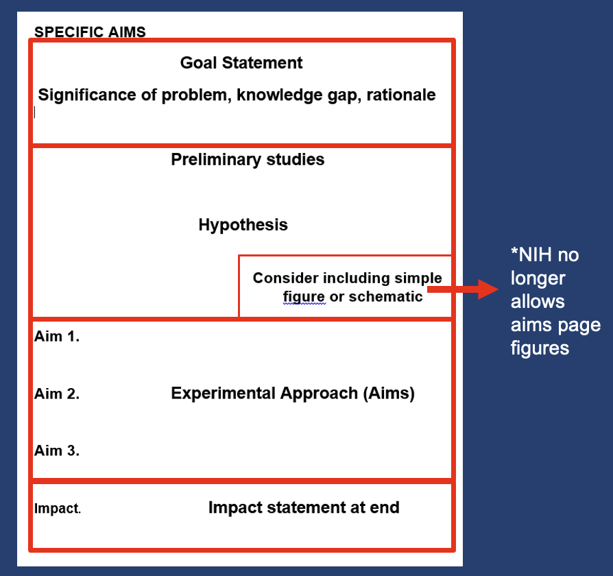

# Tutorials and experience of writing grants

### Author: Fan Zhang

Writing grants is a critical step during the journey of scientific research. Specific Aims page is the most important page for the whole grant proposal. Below we would like to highlight several key steps that we learned from our own experience and others (e.g., Dr. David Veenstra, Dr. Jennifer Kemp), focusing on drafting good Specific Aims page.

Understand your reviewers
--------
- **Reviewers are tired, so make their life easier**.
- **Use white space, bold, and underline thoughtfully**
- Use succinct sentences. Delete every word that is not needed. **Not a single word that is not needed**. 

Tips
--------
- **Use active tense**. "I will perform X analysis to ..." instead of "This analysis is done; Data will be collected."
- **Avoid jargon**. Many of them don't know the specific biology you focused on. Not all the reviewers have a similar background and understand the methods that you proposed. 

    - For example, "We propose to address these challenges using decision-analytic modeling." Reviewers may not understand why this method, if this method will work, etc. So, it would be better to write down "We propose to address these challenges using decision-analytic modeling that synthesizes findings from genomic, clinical, epidemiological, and patient outcome data."

    - Another example, something like "We will develop a non-linear computational approach using deep learning models by extending our previously established linear models" would be better than "We will develop a complex deep learning approach".

- **Preliminary data**. Where to put preliminary data?

    - Before the aims: tells a story
    - Within each aim: more precise but can seem diffuse 
    - Some of each: best of both worlds!
 
- **Writing Style**. 
    - Aim to give each paragraph a single main message
    - First and last sentences are important positions in a paragraph
    - Each paragraph should connect logically with the previous and next paragraphs
    - Aim for short and concise paragraphs (~150-200 words)
    - Subheadings help with logical flow
    - Good white space
    - Figures appear near corresponding text

- **Start early**. Don't be hesitate. Then share the draft with your mentors and collaborators

- **A Specific Aims page is NOT**: 

    - Lots of background info
    - experimental detail, 
    - Containing concepts not covered in the proposal

- [NIH Page limits](https://grants.nih.gov/grants/how-to-apply-application-guide/format-and-write/page-limits.htm) by different types of grants.

Specific Aims Structure
-------

1. **What is the problem**? `Paragraph 1` 
    - Get right to it
    
2. **What is our general approach to tackle this problem problem and your long-term goal**? `Paragraph 2`
    - Why is this particularly helpful? Goal, and how is this proposal an important step towards that goal?
    - What is the novelty? Why your research will matter (significance)?
    - General study design/methods/data type

3. **Who are you**? `Paragraph 3`
    - Give reviewers a sense of your background and previous work - why you?

4. **What is your overall goal**? `Paragraph 3`
    - Big picture statement, which give a global view and transitions to the next section of aims

5. **What do you hope to learn**? `Your Aims`
    - Aims are what you want to learn instead of what you plan to do!
    - Aims need to be related to each other and synergize with each other. Not interdependent, but complementary.
    - 2-3 aims

6. **How will you do this**? `Aims details`
    - Methods for achieving aims.
    - Your next Approach section is the most boring and difficult part of the proposal to review. You must motivate the reader to want to understand the approach BEFORE you get into the details later.

7. **What are the expected outcomes**? `Aims details`
    - Briefly describe the outcome for each aim.

8. **What are your hypotheses**? `Aims details`
    - Should have these as appropriate; but I have seen no aim-specific hypotheses. A general hypothesis before the aims section

9. **How would your results be used**? `Summary paragraph` 
    - Final paragraph sells it. Hilighlight implications, significance, and novelty. Don't mention the aim and methods again. 

## A good Specific Aims page framework
This is a great example of the template  from Dr. Jennifer Kemp. Thanks for sharing.

## Approach
    - Suggested subsections for each Aim:
    - Rationale (including Hypothesis/Subhypothesis)
    - Experimental Plan (use subaims if needed)
    - Statistical Analysis, Power Calculations
    - Rigor and Reproducibility (can also be upfront)
    - Expected Results and Interpretation
    - Potential Pitfalls and Alternative Approaches: Backup plan-What if things don’t go as planned? Not just experimental, but also if hypothesis is wrong, how are you going figure out the problem?
    
## Elements of Scientific Rigor
    - Appropriate controls
    - Replication of experiments
    - Plans to reduce bias
    - Randomization
    - Blinding
    - Inclusion/exclusion criteria
    - Sample size/study power analyses
    - Statistical methods
    - Missing data (plan to address)
    - Others as appropriate

## New NIH Review Criteria (simlified)

**Factor 1: Importance of the Research**
**Factor 2: Rigor and Feasibility**
**Factor 3: Expertise and Resources**

NIH simplified review framework: scoring guidance  
