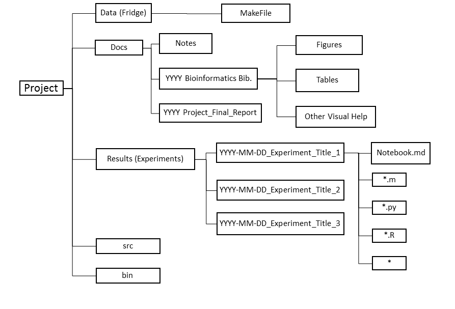

# Reproducible Experiments #

Title:		Handbook for New Members - Reproducible Experiments

Author:			Fan Zhang  

Date:			June 22, 2021  

Last update: June 22, 2021

Copyright:	

The lab is multi-disciplinary and we all have some background in genetics, computer science and statistics. Everyone has one area they're best at, one they're mediocre at and one they just survive. To be successful, find people in the lab who complement your weakness while you work to get better at all three.

The **three most important concepts in software engineering are: DRY, test, and document**. **DRY** stands for "don't repeat yourself". If you find yourself cutting and pasting code, figure out a way to make it a reusable function. **Testing** is critical to all good software development and often is ignored because it's hard to do. As a corollary, if you're good at developing boundary and unit tests, it's very easy to find a high paying job. Try to write the tests before the code or at least think of what tests you need before you write the code. Lastly, **documentation** is the key to good research and software. Comment your code. More importantly, keep a paper or electronic lab notebook. For each experiment, write down (1) the purpose of the experiment, (2) what you expect to happen as a result and (3) what you actually observed. This becomes the raw material for presentations, papers and patents. If you don't document it, it never happened.


After following this step, you are expected to be familiar with the following topics:

- [Data Management](#dh)
- [Structure of a Project Folder](#spf)
- [Standard File Formats](#sff)
- [Programming Style](#ps)

-----

## <a name = "dh"></a> Data Management ##

Please follow this procedure when downloading big or important data sets.

1. Download the data and store it in the freezer folder.
2. Change the permissions for the data to read-only.
3. Create and verify the MD5 checksum using command line. 
4. Write a README file (.txt) that contains: who downloaded the data, where they downloaded it from, when the downloaded it, any version information for the data, the MD5 checksum information.

To create a checksum, 
	
	$ md5sum urfile1.txt urfile2.txt urfile3.txt > md5.sum
	
To see the result of the checksum, 

	$ cat md5.sum
	595f44fec1e92a71d3e9e77456ba80d1  urfile1.txt
	71f920fa275127a7b60fa4d4d41432a3  urfile2.txt
	43c191bf6d6c3f263a8cd0efd4a058ab  urfile3.txt

To check the checksum value of all files, 

	$ md5sum -c md5.sum
	urfile1.txt: OK
	urfile2.txt: OK
	urfile3.txt: OK

To check the checksum value of one file, 

	$ echo "595f44fec1e92a71d3e9e77456ba80d1  urfile1.txt" | md5 -c -
	urfile1.txt: OK
	
The algorithm would create a .bam file to keep the checksum value. 

The MD5 algorithm has some vulnerabilities that you can read about on wikipedia. The current standard seems to be SHA2. However, MD5 is implemented on most systems including mac and linux and seems to be good enough for non-critical work.

In the Zhang Lab we have three levels of data, freezer data, fridge data and bench data. 

In a common wet lab, the bench data is the immediate data you collected on the bench, which is temporary but reflects the current status of your study objects. The fridge data are collected from study objects preserved in a fridge, which lasts longer than the bench data, and should be able to tell a longer story about the study objects. The freezer data is collect in an extremely cold environment where the study objects last the longest. 

In a bioinformatics lab these three levels of data meant differently but kept the same concept. 

### Freezer ###

The freezer folder, located one level above your personal directory, keeps the primary data you collected or downloaded. They should be kept in the folder once added. Since a little amount of data lost or corruption might influence the future analysis, we need to do the checksum algorithm mentioned above every time new data is added to the folder. 

### Fridge ###

The fridge contains the secondary data, which you have modified for the purpose of your project. It is not the primary data but can be considered primary for your project. To reproduce your data for the project, the algorithm you used to create the fridge data should be contained in the fridge. The detailed information of what to put in the fridge will be elaborated in the [project storage structure section](#fridge). 

### Bench ###

The bench data should be the result you get after running the data in the program you wrote. However here in the repository we only record the code you wrote to run the fridge data and the collective result you get (figures, tables, etc) since the data itself would be too big to store. However with the code that is stored here, your data result would be reproducible. 

---------
## Structure of a Project Folder ##

In the lab we have a standard way of organizing the experiment notes, data and resources so that your work is clear to everyone in the lab and helpful when compositing a research paper. 

First of all, you need to go inside your personal folder named with your linux username. Inside of that folder, create another new folder named "Research". Inside of the "Research" folder, you can create folders for all the different projects of yours. 

For each project, there are several folders you need to keep various forms of data. An example of this can be found here.



### <a name = "fridge"> </a> data (Fridge)

The fridge keeps the secondary data, which is the modified primary data specific to your project. It can be normalized, statistically analyzed, or In order to make each branch of yours smaller, we are not keeping Gigabytes of modified data in the fridge. Instead you should create a Makefile which contains the code you wrote to analyze the primary data so that the program can always run by others, and the branch is smaller in the mean time. 

**Notes on Makefile**

Makefile is a file describing the relationship (most of the times computational) among data files and providing commands for developing and updating data files. It is derived from the C recompiler yet has nothing to do with the source code in this lab. 

Makefile is a series of commandline code and the general format of a Makefile command is: 

	target:dependent(s)
	[tab]rules

Target is the output file you want as a result, dependent(s) are the files you need to create the target, and the rules include the relationship and the transformative commands between the target and the dependent. According to the rule of reproducible programming, the commands should be pre-written executable code. 

For instance, in your experiment you would like to create a `depthchart` file with a `pileup` file. The `pileup` file is created from the `bai` file, and the `bai` file is generated from the `bam` file stored in the freezer. Your Makefile command would look like this: 

	yourfile.dc : yourfile.pileup
		pileup2dc yourfile.pileup > yourfile.dc
	yourfile.pileup : yourfile.bam
		samtools ipileup yourfile.bam -o yourfile.pileup
	yourfile.bam : yourfile.sam
		samtools view -b -S -o yourfile.bam

`pileup2dc`, `samtools mpileup` and `samtools view` are pre-written executable functions.

The order of the command matters since the first file name it encounters, i.e. `yourfile.dc` in the example above, is treated as the final output file of the command. However if you have a complcated mapping of file type transformation, you can write 

	all : yourfile.dc
	
in the beginning or 

	clean : 
		rm yourfile.dc yourfile.pileup yourfile.bam
	
at the end of your commad so that the `all` file or the file that is not cleaned is recognized as the final output file type. 


### docs

The Docs folder keeps the documents needed to construct the final paper. The first subfolder is "Notes", where you keep all the experiment notes that is useful to your final paper. The rest subfolders keeps all the tables, figures and other visual aids you plan to use. They should be separated by papers/reports since various journals may ask the scholar to arrange their tables and figures differently and separating them would be the easiest when the time comes to composite the final research paper. 

### results

The results folder is the most detailed and important one of all folders (although every one of them is quintessential). All the subfolders in the "Results" folder are experiments you did for this project. They should be named precisely as *YYYY-MM-DD_Project Name* so that the computer may sort the experiments according to their start date. Inside of each experiment folder, you should keep a notebook, which is a markdown file containing the purpose, the materials and methods, the results and the conclusion of the experiment. The markdown file should be written using your text editor installed above and it will be the primary source of your research paper. Also, all the python, R and any other assisting code files should be saved alongside the notes as well.

### src (source)

The source folder contains all the combined code you write for the experiment. Inside of the result might be pieces of small functions you write to run one specific step of the experiment, while in the source folder you should keep versions of the complete program.

### bin

The bin folder contains all the executable files. They might be programs you find online that are helpful to the experiment, or they are compiled programs that you can execute with one command when programming. The folder is important for reproducible programming. 

```
mkdir ~/.local/bin
echo $HOME
$HOME is the same thing as ~

vim ~/.bash_profile
# ~/.bash_profile export PATH="$HOME/.local/bin:$PATH
```


--------
##<a name = "sff"></a> Standard File Formats
You will often be reading and writing data and results files. In order to standardize the interface between apps that we write we use some standard file formats for data management.

**Use HDF5 or CSV formats for data and models.** Python has libraries (pytables, h5py) to read/write HDF5.

**Use Markdown for documentation and notebook files.**  

**Use .pdf and .png for plots.**

**Use .ai for figures.**

**Use docx or tex for manuscripts.**

-----


## <a name = "ps"></a> Programming Style ##
We use functional programming for the majority of projects in the lab and we use object-oriented programming only where it really makes sense.

Pure functions have meet two criteria:

1. *Referential Transparency* - They always return the _same result_ given the _same arguments_.
2. *No side-effects* - They don't change the external world by changing external objects or interacting with i/o channels.

Most of your code will fall into the pure function category and you can keep things orderly by following a few guidelines for the exceptions.

- If your function does interact with some i/o channel make sure that is the only thing your function does. Don't write a function that does some computation then writes the output to a file. Refactor to separate functions; one that computes and one that saves. Think of the "print" function here.'
- Do your best to avoid global variables. This is not always possible, but should be absolutely minimized.
- GOTO is ok. "return" and "continue" commands in C and python accomplishes a goto-like behavior. "exceptions" do a similar thing in higher level programs like python as well.


# Set up Jupyter working environment and install dependencies #

#### Install conda
https://docs.conda.io/projects/conda/en/latest/user-guide/install/linux.html
`bash Miniconda3-latest-Linux-x86_64.sh`

#### Install tmux
`conda install -c conda-forge tmux`

#### Install jupyter
https://github.com/jupyterlab/jupyterlab#installation
`conda install -c conda-forge jupyterlab`

#### Install jupyter lab extensions
`conda install -c conda-forge nodejs`

#### Install R 

`conda install -c conda-forge/label/gcc7 r-base `  install **R 3.6.1** (current using)

`conda install -c conda-forge r-base` 


#### Install IRKernel 
Option 1: IRkernel needs to be installed through github devtools on linux. 

```
install.packages("devtools")
library(devtools)

install.packages("BiocManager")
BiocManager::install()

install_github("RBigData/pbdZMQ") (not working)
BiocManager::install(pbdZMQ) (current working)

devtools::install_github("IRkernel/IRkernel")

IRkernel::installspec()

# Install dependencies ‘repr’, ‘IRdisplay’, ‘pbdZMQ’, 'htmltools', and ‘uuid’ 

```

Option 2: `conda install -c r r-essentials`


#### Making the kernel available to Jupyter
`IRkernel::installspec()`


Refer to https://github.com/jupyterlab/jupyterlab
- `module load libcurl`
- `module purge`
-`module load R/3.4.0`
- `npm i jupyterlab-toc`
- `export R_LIBS="/PHShome/fz049/R/x86_64-pc-linux-gnu-library/3.4/"` `rev(.libPaths())`

### Remote Jupyter
Refer to https://gist.github.com/molpopgen/3267efe08a0a4c23835249a955db37a2

#### On server:
`jupyter lab --no-browser --port=8888`

#### On laptop terminal:
`ssh -N -L 8888:localhost:8888 cn009`


### Some tips of working on the server: e.g., conda forge

- Error: `(nzchar(SHLIB_LIBADD)) SHLIB_LIBADD else character()`:
Check the `miniconda3/lib/R/etc/` **Makeconf** file
 
 
 
- No such file /miniconda/bin/x86_64-conda_cos6-linux-gnu-gcc:
`conda install gxx_linux-64`
provides x86_64-conda_cos6-linux-gnu-c++
`conda update conda`


- Have to change `~/.R/Makevars` if updating the minoconda path for the CPP file and other related files: No space between "L" and "/apps/.../lib"

```
CXX11=/PHShome/fz049/miniconda3/bin/x86_64-conda_cos6-linux-gnu-c++
CC=/PHShome/fz049/miniconda3/bin/x86_64-conda_cos6-linux-gnu-gcc
CPP=/PHShome/fz049/miniconda3/bin/x86_64-conda_cos6-linux-gnu-cpp
CXXFLAGS+=-I /apps/lib-osver/isl/0.16.1//include -L/apps/lib-osver/isl/0.16.1//lib
LDFLAGS+=-L/PHShome/fz049/miniconda3/lib/
```

- Broken jupyter notebook kernel integration with conda environments:

```
conda install --channel=conda-forge nb_conda_kernels
conda install -c anaconda ipykernel
```

- How to ssh to a remote server without typing your password:
https://slowkow.com/notes/ssh-tutorial/


- When you have to compile software, do this:

```
cd /data/fzhanglab/fzhang/src
wget whatever.tar.gz
tar xf whatever.tar.gz
cd whatever
./configure --prefix=~/.local
make
make install
```


# Popular Vim comments

```
yy - Copies a line

yw - Copies a word

y$ - Copies from where your cursor is to the end of a line

v - Highlight one character at a time using arrow buttons or the h, k, j, l buttons

V - Highlights one line, and movement keys can allow you to highlight additional lines

p - Paste whatever has been copied to the unnamed register

d - Deletes highlighted text

dd - Deletes a line of text

dw - Deletes a word

D - Deletes everything from where your cursor is to the end of the line

d0 - Deletes everything from where your cursor is to the beginning of the line

dgg - Deletes everything from where your cursor is to the beginning of the file

dG - Deletes everything from where your cursor is to the end of the file

x - Deletes a single character

u - Undo the last operation; u# allows you to undo multiple actions

Ctrl + r - Redo the last undo

. - Repeats the last action


:14 - You can also use the ex command line to go to a line

/blimp - Press Esc and then enter /pattern, replacing pattern with the text for which you want to search forward. 
To look for the next occurrence after the first, either press n or press / again and then press Enter. 
To go back to a previous occurrence, press Shift-n. To search backwards in a file, use the ? command.

:noh - To turn off highlighting until the next search

j and k move down and up one line, so 10j and 10k move down and up ten lines. 

```

Besides, check the ways of how to easily move your cursor in Vim:


# Software #

We primarily use [R](/https://www.r-project.org/), [Python](http://www.python.org) and C. Occasionally, you'll need to use another language such as bash shell, but only for very simple tasks that you could probably also do with one of those three. Google considers Python and C two of their core languages.

- [Python](#py)
- [LaTeX](#latex)
- [Gurobi](#grb)
- [IGV](#igv)


## <a name = "py"> </a> Python ##
Learn about testing using the [nose](http://nbviewer.ipython.org/github/swcarpentry/2012-11-scripps/blob/master/python/testing-with-nose.ipynb) framework.  Learn about sharing results using [ipython](http://ipython.org) notebooks. Learn about virtual environments

### Essential Python Toolboxes ###

A good book to get started in data analysis with python is "Python for Data Analysis" by O'Reilly. You can read it through Safari Ebook at the Gordon Library.

These are core modules and should always be available.

- [scikits.learn](http://scikit-learn.org/0.6/index.html) - machine learning and data mining
- [ipython](http://ipython.org) - interactive shell
- [pandas](http://pandas.pydata.org) - data frame object similar to R
- [scipy](http://www.scipy.org) - fundamental scientific module
- [numpy](http://numpy.scipy.org) - fundamental numerics module
- [matplotlib](http://matplotlib.org) - fundamental plotting module
- [pep8](http://pypi.python.org/pypi/pep8) - code style checking
- [cloud](http://www.picloud.com) - access to PiCloud's cloud-computing platform
- [unittest](http://docs.python.org/2/library/unittest.html) - unit testing framework


### Machine-Learning & Statistics Modules ###
- [scikits.image]
- [scikits.timeseries]
- [statsmodels]
- [MDP]
- [Pycluster]
- [pytables]
- [PIL]

### Development Utilities Modules ###
- [coverage]
- [nose]

- [distribute]
- [scons] - substitute for make
- [codetools] - code analysis and execution tools
- [docutils]
- [Cython]

### Data Input/Output Modules ###
- [configobj]
- [h5py]
- [hdf5]
- [curl]
- [xlrd]
- [xlwt]

### Bioinformatics Modules ###
- [biopython]

### Plotting Modules ###
- [libjpeg]
- [libpng]
- [enable] - low-level drawing and interaction
- [chaco] - interactive 2D plotting
- [nodebox](http://nodebox.net)- visualization tools similar to Processing.js

### Internet Interface Modules ###
- [tornado]
- [Twisted]

## <a name = "igv"></a> IGV ##

The Interactive Genomic Viewer is a high performance visualization tool for interactive exploration of large, integrated genomic datasets. It supports a wide variety of data types, including array-based and next generation sequence data, and genomic annotations. You may get the latest version of IGV [here](http://www.broadinstitute.org/software/igv/download), and read about how to use the software [here](http://www.broadinstitute.org/software/igv/UserGuide).

## <a name = "latex"> </a> LaTeX ##

LaTeX is a document preparation system and a high quality typesetting system that is designed for scientific and technical documentation. It is a programming system with simple syntax but great text format. Also, the beamer package embedded in LaTeX allows us to create presentations which are compatible to the git version control system. A simple introduction to LaTeX documentation can be found [here](http://www.latex-project.org/) and an introduction to LaTeX Beamer can be found [here](http://en.wikibooks.org/wiki/LaTeX/Presentations). If you would like to learn specific how-tos, you may go on to [TeX forum](http://tex.stackexchange.com/) or simply google to see how others have solved similar problems. 

## <a name = "grb"> </a> Gurobi ##

Gurobi is an optimizer we use in the lab for mathematical programming. It is compatible with multiple programming interface including python.

When installing gurobipy for python on MacOSX 10.8 you need to make the following changes.
 
https://groups.google.com/forum/#!msg/gurobi/ArCkf4a40uU/R9U1XFuMJEkJ

When trying to use Gurobi with Enthought's latest Canopy (formerly EPD), you'll probably get something like

    $ ipython 

    In [1]: import gurobipy
    Fatal Python error: PyThreadState_Get: no current thread
    Abort trap: 6 


or some Library not found error.

Here's what you need to do to get this fixed on Mac OS 10.8 (with Xcode installed):

    $ python setup.py install (skip this line if you already installed Gurobi in Canopy's site-packages)
    In your ~/.profile, append the following after Canopy's call to source the activation file:
    export DYLD_LIBRARY_PATH=/Library/gurobi550/mac64/lib:$DYLD_LIBRARY_PATH
    export DYLD_FRAMEWORK_PATH=/Library/gurobi550/mac64/lib:$DYLD_FRAMEWORK_PATH 
    Fix the shared library (change USERNAME to your user name!)
    $ install_name_tool -change /System/Library/Frameworks/Python.framework/Versions/2.7/Python /Users/USERNAME/Library/Enthought/Canopy_64bit/User/Python /Users/USERNAME/Library/Enthought/Canopy_64bit/User/lib/python2.7/site-packages/gurobipy/gurobipy.so

Step 3 needs to be repeated every time Gurobi is updated to a new version (until the issue is fixed of course).

# Other Servers #

### Amazon Machine Image (AMI) ###

You might have large amount of calculations to be done for your experiment. If the calculation requires 64 core server, the redwood server can handle it. However if it requires more, the processing time would be a lot longer if the work is done on redwood. Here we distribute the work to Amazon, which provides an amazing service "Amazon Machine Image" to do the calculation for us. The CrossCompute Amazon Machine Image has an iPython(interactive parallel computing in Python) notebook server with: numpy, scipy, h5py, pytables, matplotlib, pyramid, scikit-learn, pandas, statsmodels, networkx, theano, gdal, pysal, shapely. You need to launch a High-CPU Medium Instance to use it. The on-demand price is $0.145 per worker per hour and the spot instance price is $0.018 per worker per hour. The user's guide can be found [here](http://docs.aws.amazon.com/AWSEC2/latest/UserGuide/AMIs.html).

#### STAR Cluster ####

Although we usually use the iPython notebook to distribute our work, there are other toolkit to simplify the process of building, configuring, and managing clusters of virtual machines on Amazon’s Elastic Compute Cloud. It is designed by MIT and can be found [here](http://star.mit.edu/cluster/) as an open source cluster-computing toolkit. 

#### Message Passing Interface (MPI) ####

MPI is a language-indeendent communications protocol used to program parallel computers. Both point-to-point and collective communication are supported. The MPI Python implementations include: pyMPI, mpi4py, pypar, MYMPI, and the MPI submodule in Scientific Python. [Here](http://www.mcs.anl.gov/research/projects/mpi/tutorial/index.html) you may find some tutorials and exercises to MPI. 

#<a name = "app"> </a> Appendix #

## Recommended Reading ##

There are a few good background books on research, bioinformatics and machine learning that will help you become a productive member of the lab. These are organized more by topic and rating. 
(xxx) = essential
(xx) = recommended
(x) = useful

We primarily use [Python](http://www.python.org) and C. Occasionally, you'll need to use another language such as bash shell, but only for very simple tasks that you could probably also do with one of those three. Google considers Python and C two of their core languages.


Go through the [Software Carpentry](http://software-carpentry.org) lectures on [version control](http://software-carpentry.org/lessons.html) (xxx), the shell, python, testing. 

**To Be Developed**

Check out the [Brown University course] (https://www.coursera.org/course/matrix) on Computer Science Application of Linear Algebra. 

## Software Engineering and Programming ##

[The Practice of Programming by Kernighan and Pike](http://cm.bell-labs.com/cm/cs/tpop/)(xxx)

Try out a few sample bioinformatics problems to build your programming skills and thinking about bioinformatics problems. 
 * [Rosalind](http://rosalind.info)


# Unfinished Business #

We can also create our own virtual machine loaded with enthought and other stack options. Anyone want to take the initiative on this?
