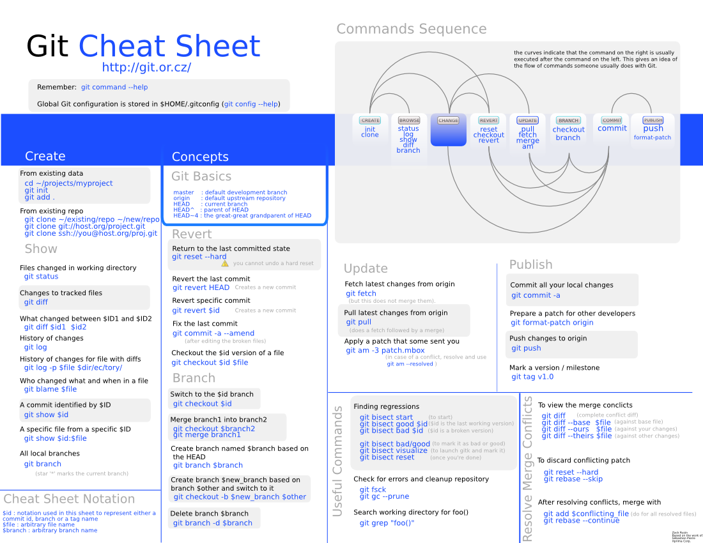

# Your First Day #

**Author**: Fan Zhang

**Last Update**: December, 2025


Congratulations, and welcome! This guide is written by people who've been where you are and want to help you to have a productive and successful experience here.

First, ask Dr. Zhang to add you to our lab [Github](https://github.com/fanzhanglab) and [Slack](zhanglab.slack.com) space.
```
- We use Github to perform data analysis for each project-driven repository for final publishing. 
  (This can be viewed as electric lab notebook, e.g., R markdown or Jupyter)
- We use Slack for easy communication.
- For manuscript writing, we use Google Drive/Google docs which enables multiple people working together.
- For reference, we use paperpile which is a literature reference software to insert and sync references. 
- For high quality figure generation, we use Illustrator and BioRender if needed.
- We also use OneDrive to share files between lab members since we have unlimited space from CU.
```

Second, if you do not yet have a CURC account via XSEDE, please go ahead and create one, per [this tutorial](https://curc.readthedocs.io/en/latest/access/rmacc.html). Once you have an account, send an email to rc-help@colorado.edu, and ask them to help add you to `fanzhanglabgrp` so that you can access our lab space `/pl/active/fanzhanglab` if needed.

Then, you should first read through this document and configure your computer with necessary software. Understanding the contents in this document will help you establish a good habit on conducting reproducible computational experiments.

We do
1) large-scale processing using Alpine server. For example, learn how to submit a HPC job at [this tutorial](https://github.com/ResearchComputing/CU_DENVER_HPC_2019/blob/master/Job_Submission/hpc_job_submission_CU_Denver_summer2019.pdf).
 More interesting computing resource including writing scripts and hpc can be found at [CU Boulder Research Computing](https://github.com/ResearchComputing).
2) then grab the processed data to our local box (e.g. Jupyter notbook) 
3) share code and key results at specific Github repo 
4) archive key results data and figure at Alpine storage space


## 1. Request your account on our server `Alpine`
Refer to this [step-by-step tutorial](https://github.com/fanzhanglab/Zhang_lab_manual/blob/main/Alpine_Help.md) that we have documented.

## 2. Set up your local working environment
If possible, please install latest R version, Python version, and jupyterlab on your local computer for your own convenience. You can sync your OneDrive folder to your local laptop, then save the processed data (e.g., single-cell RNA-seq gene x cell matrix) into folders from OneDrive, which saves your local laptop storage space. When you code under Jupyterlab environment, you can just access these data from OneDrive.

[Here](./reference/linux_tutorial.pdf) is a recommended unix tutorial and tips. You can skip the first part and start reading from Page 6.

Writing good bash scripts can be challenging. Use this [guide](http://www.tldp.org/LDP/abs/html/) to get the basics. And use this [guide](http://www.davidpashley.com/articles/writing-robust-shell-scripts.html) to make your code more robust.


## 3. Sharing code and results through Github
We manage our code repository for each project at https://github.com/fanzhanglab. We strongly encourage every lab member to share code and key results at Github for the purpose of tracking changes, sharing experience, and enhancing collaborations. Refer to [Project Folder](https://github.com/fanzhanglab/Zhang_lab_manual/blob/main/reproducible_research.md#structure-of-a-project-folder) about how to specifically build a Github repo structure.

Please learn version Control by Git:

We use a version control system git in the lab extensively. The system has a tree structure that bears all the work in the shared drive. Git allows many people to work on the same project at the same time, and avoids the confusion caused by keeping track of the updated versions of the same file. The following paragraph describes the steps for your to complete a job using Git.

At the beginning of your work, you should **clone** a copy of the repository to your local drive and this is your own branch of the central repository. You can edit the files under the copied repository. All work should be saved under the copy of the repository in the end. Here you may **stage (add)** your changes to save it on your own branch, **commit** your changes to make recorded changes to your own branch, and **push** your changes to make recorded changes to the main repository. Also, you would be able to **fetch** from the main repository to see what others have done to the same experiment and **pull** the changes if you feel like merging others' work with yours. All the changes made to the main repository is recorded so that the activities at any time spot can always be undone. 

If there's any collision where you and your teammate have done the same changes to the repository, only the first one who pushes would be able to push and the second push would be denied. Whenever this happens, the second person should first pull from the first person and push again to make other changes. To keep the collision to a minimum, you and your teammate should keep the communication open and distribute the work properly to make sure that you are working accordingly and efficiently on the project. 

The GIT Graphic User Interface (GUI) is very useful and easy to start with software for version control purposes in the lab. The detailed instructions of the commands will be introduced in later parts of this document. 


A good intro is available [here](http://pcottle.github.io/learnGitBranching/). And here is a good [cheat sheet](http://zrusin.blogspot.com/2007/09/git-cheat-sheet.html) for Git commands.



###### Commonly Used GIT Commands ##

- `$ git status`: Show the working tree status.
- `$ git clone`: Clone the existing project. 
- `$ git pull`: Fetch from and merge with another repository or a local branch.
- `$ git add`: Add file contents to the index.
- `$ git commit`: Record changes to the repository. You can use `git commit -m` and a quoted sentence to describe what you have done.
- `$ git push`: Update remote refs along with associated objects. Only pushed files can be seen by others. Committed files won't be seen by others.

###### Checking what branches are available ##

* `$ git ls-remote` shows all of the branches that are available remotes regardless of whether you're tracking them locally or not.
* `$ git branch` shows all of the _local_ branches 
* `$ git branch -r` shows all of the _remote_ branches being tracked

###### Switching branches ##

Often we want to switch to a different branch that's available on the server.  

1. `$ git remote` Shows the names of the remote server nicknames that you can pull from. Call this `<repository>`.
	
2. `$ git ls-remote <repository>` Shows the branches that are available on that repository that you can pull from. It's best to pull a branch that is also a head. You can isolate those using `$ git ls-remote --heads <repository>`.  
	
3. `$ git pull <repository> <branch>` Pulls a current branch from the repository. Make sure you don't have any uncommitted changes; if so use the stash. 


## 4. Archive key results data and figure
To deliver the results, we will eventually publish our code together with key metadata files. For example, we will need to save a copy of the results (e.g., cluster labels for each cell barcode) to the project folder at Alpine. 

Once we finalize the results for pubishing, we will upload both original data and key results data to public domains, e.g, NIAID ImmPort.
